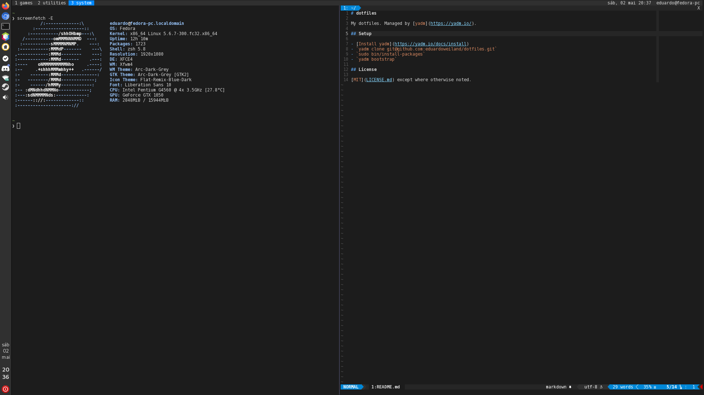

# dotfiles

My dotfiles. Managed by [yadm](https://yadm.io/).

[MIT](LICENSE.md) except where otherwise noted.

## Setup

- `sudo dnf config-manager --add-repo https://download.opensuse.org/repositories/home:TheLocehiliosan:yadm/Fedora_Rawhide/home:TheLocehiliosan:yadm.repo`
- `sudo dnf install -y yadm`
- `yadm clone git@github.com:eduardoweiland/dotfiles.git`
- `sudo bin/install-packages [work|home]`
- `yadm bootstrap`
