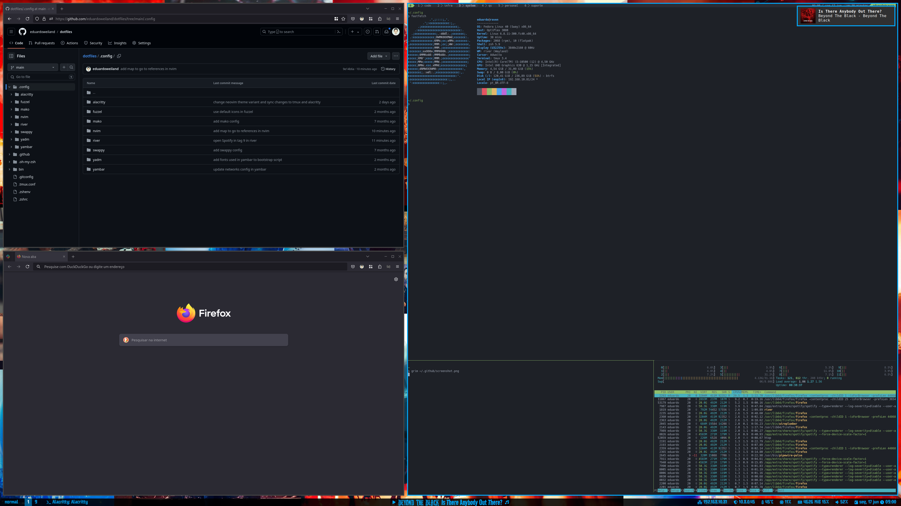

# dotfiles

My dotfiles. Managed by [yadm](https://yadm.io/).

[MIT](LICENSE.md) except where otherwise noted.

## Setup

- [Install yadm](https://yadm.io/docs/install)
- `yadm clone git@github.com:eduardoweiland/dotfiles.git`
- `sudo bin/install-packages`
- `yadm bootstrap`
